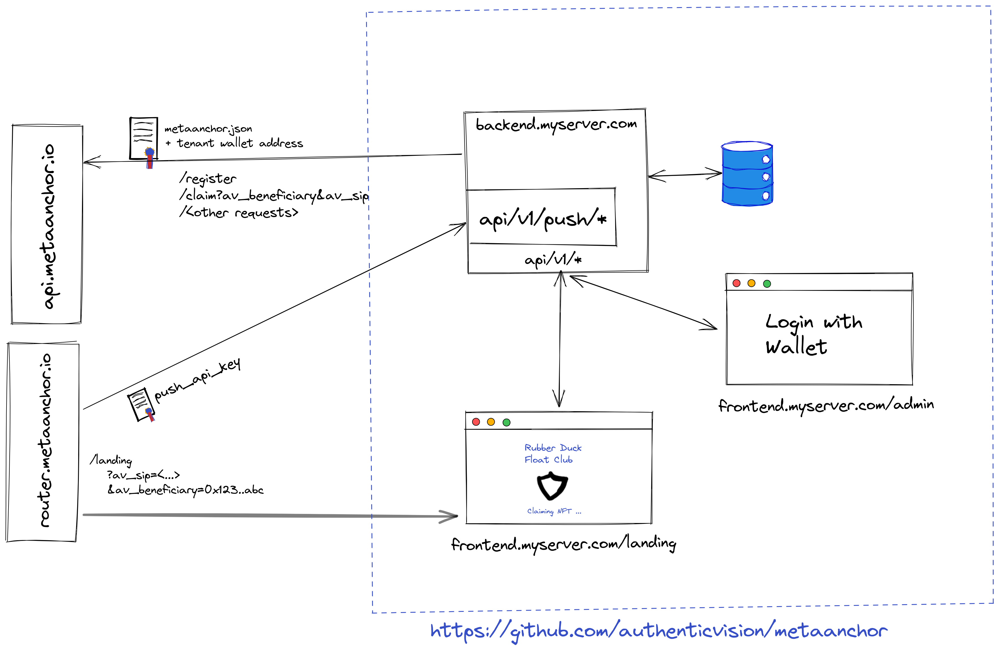

# Refurbish Concept
This gathers the rough concept of the metaanchor-framework

## Overall architecture



The component diagram is a very rough view on how the metaanchor-framework (right part in dashed blue box) interacts with `https://router.metaanchor.io` and `https://api.metaanchor.io`

- `backend.myserver.com` should be NEST-JS
- `frontend.myserver.com` should be (???)
- `db.myserver.com` should be (???)

### Overall requirements
- The framework is [multi-tenant](https://en.wikipedia.org/wiki/Multitenancy). 
  - Tenants are defined as users logging in to `frontend.myserver.com/admin` with different wallets.
  - Tenants shall not have direct access to the database or the actual server, where services are running.
  - Tenants may be of the same or a different organization, i.e. work and configure the same or different smart contracts
  - TODO define how a server knows which tenants are permissible
- In a user-hosted setting, there is typically only one tenant
- Per default (if users do not host their own framework), all tenants will use a `metaanchor.io`-hosted multi tenant setup.
- The requests to `api.metaanchor.io` shall be kept to a minimum
- `router.metaanchor.io` shall never be called by the framework, but will call the framework.

## Scan-Flow and NFT-Claim

TODO in detail, matches behavior of MAC, RDFC, ... 

## Collection Administration

TODO wireframes

## Setup and Discovery

### Setup steps
-  User has one command he needs to copy-paste onto his server which guides him through installation. E.g. `curl https://www.example.com/files/install-metaanchor.sh -o install-metaanchor.sh && ./metaanchor.sh`. 
   - Any other user-friendly approach works as well!
   - The user is asked to paste the API-Key into setup
   - API Key is validated against api.metaanchor.io. If invalid, error out.
   - User can configure setup (e.g. Ports etc..)
- Images are built, installed and started. This contains
  - `backend.myserver.com`
  - `frontend.myserver.com`
  - `db.myserver.com` (not publicy accessible!)
  - An `push_api`-key is generated, which can be used from `api.metaanchor.io` to push new information (e.g. new supported SLIDs etc., inform about updates etc). **We can also discuss alternative authorization options to allow api.metaanchor.io to push information to the local running instance..**
- Discovery & Init is run
  - Database is synched from metaanchor_api (LINK XXX)
- During setup `backend.myserver.com/status` indicates the initialization status and potential error messages. 
  - As soon as setup is complete, this endpoint is no longer available (privacy reasons)


### Discovery 
When started, `https://api.metaanchor.io/api/v1/register` is called with the API-Key. In an ideal case, the server can resolve it's own public address

Payload:
```
{
    "port": {
        "frontend": 5071,
        "backend": 5020
    }
    "uri": {
        "frontend": "https://frontend.myserver.com",
        "backend": "https://backend.myserver.com"
    }, 
    "push_api_key": "..."
}
```

`uri` is optional. Per default, api.metaanchor.io will try to resolve your server's public address through the REFERRER of the requst sent to `https://api.metaanchor.io/api/v1/register`. Note this will only work for simple setups, in case you have more complex routing, please provide URI. 

`push_api.api_key` is an api-key, which is authorized to access `backend.myserver.com/api/v1/push/*`


### api/v1/push/*

For synchronizing information from the internal MetaAnchor-Infrastruktur to your deployed metaanchor-framework, the `api/v1/push/*` endpoints are designed. Under these endpoints your setup receives information and data from the MetaAnchor-Infrastructure in a secure way, i.e. only `metaanchor.io` will be accepted as sender.

Endpoints:

- `api/v1/push/slids` ... receives all supported SLIDs of your setup. In case we add new SLIDs, this endpoint will be called
- `api/v1/push/notify` ... Interface to send notice, update-notifications etc
- `api/v1/push/status` ... Returns a status report (Hashes of SLIDs, ..., allowing metaanchor to remote-monitor)
- ...   

